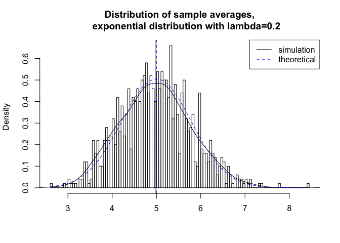
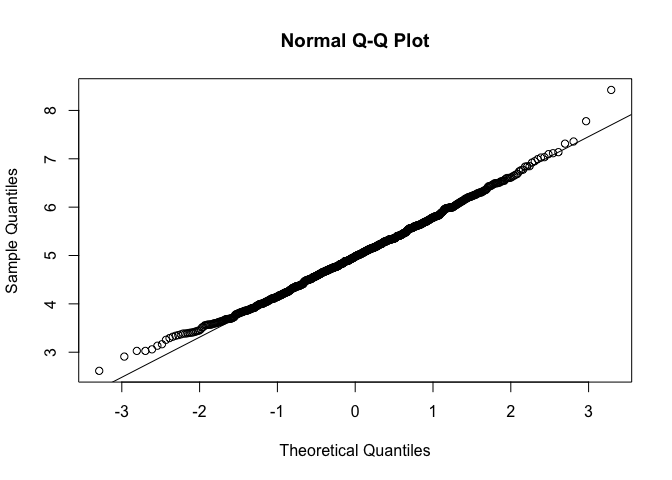

# Statistical Interference Course Project Part 1: Simulation Exercises
Yisong Tao  
August 22, 2015  

In this project I will investigate the exponential distribution in R and compare it with the Central Limit Theorem. The exponential distribution can be simulated in R with `rexp(n, lambda)` where lambda is the rate parameter. The mean of exponential distribution is 1/lambda and the standard deviation is also 1/lambda. Set lambda = 0.2 for all of the simulations. I will investigate the distribution of averages of 40 exponentials. 

I did 1000 simulations of exponetional distribution with lambda = 0.2.

```r
# simulation
set.seed(11)
lambda <- 0.2
sim_num <- 1000
sample_size <- 40
sim <- matrix(rexp(sim_num*sample_size, rate=lambda), sim_num, sample_size)
r_means <- rowMeans(sim)
```

The sample means are plotted in histogram along with theoretical mean and theoretical density.


```r
# plot the histogram of averages
hist(r_means, breaks=100, prob=TRUE,
     main="Distribution of sample averages,
     exponential distribution with lambda=0.2",
     xlab="")
# density of the averages of samples
lines(density(r_means))
# center of the sample averages
abline(v=mean(r_means), col="black")
# theoretical center of distribution
abline(v=1/lambda, lty=2, col="blue")
# theoretical density of the averages of samples
xfit <- seq(min(r_means), max(r_means), length=100)
yfit <- dnorm(xfit, mean=1/lambda, sd=(1/lambda/sqrt(sample_size)))
lines(xfit, yfit, pch=22, col="blue", lty=2)
# add legend
legend('topright', c("simulation", "theoretical"), lty=c(1,2), col=c("black", "blue"))
```

 

The figure above shows that sample mean (black) and theoretical mean (blue) of the simulation. The central limit theorem dicatates that the averages of sample follow normal distribution. The figure above also shows that density computed with using histogram and the normal density plotted with theoretical mean and variance.

The distribution of sample averages is centered at 4.9871567, and the theoretical center is at 5. The sample variance is 0.6509313 and the theoretical variance is at 0.625.


```r
# making a Q-Q plot
qqnorm(r_means); qqline(r_means)
```

 

The Q-Q plot above shows that the distribution of sample averages in our simulation do follow a normal distribution approximately.
