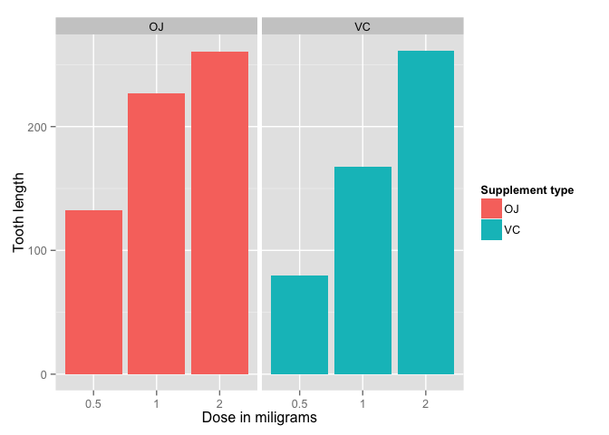

# Statistical Interference Course Project Part 2: Basic inferential data analysis
Yisong Tao  
August 22, 2015  

In this part of the project, we analyze the `ToothGrowth` data in the R datasets package. The data is set of 60 observations, length of odontoblasts (teeth) in each of 10 guinea pigs at each of three dose levels of Vitamin C (0.5, 1 and 2 mg) with each of two delivery methods (orange juice or vitamin C pills).


```r
library(datasets)
data("ToothGrowth")
str(ToothGrowth)
```

```
## 'data.frame':	60 obs. of  3 variables:
##  $ len : num  4.2 11.5 7.3 5.8 6.4 10 11.2 11.2 5.2 7 ...
##  $ supp: Factor w/ 2 levels "OJ","VC": 2 2 2 2 2 2 2 2 2 2 ...
##  $ dose: num  0.5 0.5 0.5 0.5 0.5 0.5 0.5 0.5 0.5 0.5 ...
```

```r
head(ToothGrowth)
```

```
##    len supp dose
## 1  4.2   VC  0.5
## 2 11.5   VC  0.5
## 3  7.3   VC  0.5
## 4  5.8   VC  0.5
## 5  6.4   VC  0.5
## 6 10.0   VC  0.5
```

```r
summary(ToothGrowth)
```

```
##       len        supp         dose      
##  Min.   : 4.20   OJ:30   Min.   :0.500  
##  1st Qu.:13.07   VC:30   1st Qu.:0.500  
##  Median :19.25           Median :1.000  
##  Mean   :18.81           Mean   :1.167  
##  3rd Qu.:25.27           3rd Qu.:2.000  
##  Max.   :33.90           Max.   :2.000
```


```r
library(ggplot2)
ggplot(data=ToothGrowth, aes(x=as.factor(dose), y=len, fill=supp)) +
    geom_bar(stat="identity",) +
    facet_grid(. ~ supp) +
    xlab("Dose in miligrams") +
    ylab("Tooth length") +
    guides(fill=guide_legend(title="Supplement type"))
```

 

Clearly there is a positive correlation between tooth length and vitamin C dose for both delievery methods. We are going to use regression analysis to quantify their relationship below.


```r
fit <- lm(len ~ dose + supp, data=ToothGrowth)
summary(fit)
```

```
## 
## Call:
## lm(formula = len ~ dose + supp, data = ToothGrowth)
## 
## Residuals:
##    Min     1Q Median     3Q    Max 
## -6.600 -3.700  0.373  2.116  8.800 
## 
## Coefficients:
##             Estimate Std. Error t value Pr(>|t|)    
## (Intercept)   9.2725     1.2824   7.231 1.31e-09 ***
## dose          9.7636     0.8768  11.135 6.31e-16 ***
## suppVC       -3.7000     1.0936  -3.383   0.0013 ** 
## ---
## Signif. codes:  0 '***' 0.001 '**' 0.01 '*' 0.05 '.' 0.1 ' ' 1
## 
## Residual standard error: 4.236 on 57 degrees of freedom
## Multiple R-squared:  0.7038,	Adjusted R-squared:  0.6934 
## F-statistic: 67.72 on 2 and 57 DF,  p-value: 8.716e-16
```

The intercept is 9.2725, meaning that with no supplement of Vitamin C, the average tooth length is 9.2725 units. The coefficient of dose is 9.7635714. It means that by increasing the delievered dose 1 mg, all else equal (i.e. no change in the supplement type), would increase the tooth length by 9.7635714 units. The last coefficient is for the supplement type. Since the supplement type is a categorical variable, dummy variables are used. The computed coefficient is for suppVC and the value is -3.7 meaning that delivering a given dose as vitamin c pills, without changing the dose, would result in 3.7 units of decrease in theincrease of  tooth length. 

The 95% confidence intervals are as following:


```r
confint(fit)
```

```
##                 2.5 %    97.5 %
## (Intercept)  6.704608 11.840392
## dose         8.007741 11.519402
## suppVC      -5.889905 -1.510095
```

The 95% confident intervals tell us that based on our data and analysis, there is a 95% probability that any new data under the same experimental condition will give us the estimates in the intervals above. The null hypothesis is that the coefficients are 0, which means the variables have no effects on tooth length. All p values in our case are less than 0.05, resulting in rejection of null hypotheses and all 3 variables in our regression model are significant in explaining tooth growth under the experimental conditions, assuming the significance level is 5%.
